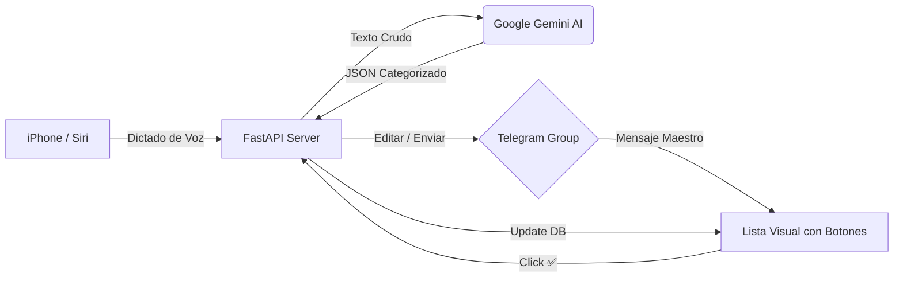

<div align="center">
  
  
  
  
  
</div>

<br />

<div align="center">
  <h1>🛒 Siri Smart Shopping List Bot</h1>
  <p><b>Transforma tu voz en una lista de la compra inteligente, categorizada y libre de spam.</b></p>
</div>

---

## 🌟 La Experiencia
Olvida los chats llenos de mensajes sueltos. Con este bot, la gestión de tu hogar sube de nivel:

1. **"Oye Siri, añade a la compra..."** 🗣️
2. La **IA (Gemini)** separa los productos y les asigna su pasillo/categoría automáticamente. 🧠
3. Un **único mensaje maestro** se actualiza en vuestro grupo de Telegram. 📌
4. Tachas los productos con un toque mediante **botones interactivos**. ✅

---

## 🛠️ Flujo de Trabajo



---

## ✨ Características Premium

- 🟢 **Master Message Concept**: Olvida el scroll infinito. Solo existe UN mensaje que se edita mágicamente.
- 📂 **Categorización Dinámica**: Frutas, Lácteos, Limpieza... todo en su sitio gracias a la IA.
- 🧹 **Modo Janitor (Conserje)**: El bot borra cualquier mensaje ajeno para mantener el chat impoluto.
- 📌 **Auto-Pin & Recovery**: Si el servidor se apaga, el bot recupera la lista buscando el mensaje fijado.
- 🔒 **Security First**: Autenticación por Bearer Token y filtrado de usuarios autorizados.

---

## 🚀 Despliegue en 5 Minutos

### 1. Preparación Local
```bash
git clone https://github.com/BorjaDelgadoDev/chatboot-telegram.git
cd chatboot-telegram
pip install -r requirements.txt
cp .env.example .env
```

### 2. Configuración (Variables de Entorno)
| Variable | Descripción |
| :--- | :--- |
| `TELEGRAM_TOKEN` | Token de @BotFather |
| `GEMINI_API_KEY` | API Key de Google AI Studio |
| `CHAT_ID` | ID del grupo de Telegram |
| `SIRI_AUTH_TOKEN` | Contraseña para el Atajo de iOS |

### 3. ¡A Volar!
Lanza el servidor localmente:
```bash
uvicorn main:app --reload
```
O simplemente conéctalo a **Render** o **Railway** usando el `Procfile` incluido.

---

## 📱 Atajo de Siri (iOS)
Para una integración total, configura un Atajo en tu iPhone:
- **Acción**: Dictar texto.
- **Acción**: Obtener contenido de URL (POST).
- **Header**: `X-Auth-Token` : `TuTokenElegido`.
- **JSON Body**: `{"text": "Variable del dictado"}`.

---

<div align="center">
  <sub>Desarrollado con ❤️ para organizar hogares inteligentes.</sub>
</div>
