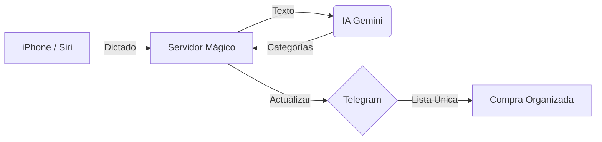

  
  
  
  
  

 

  <h1>🛒 Siri Smart Shopping List Bot</h1>
  
<b>Transforma tu hogar con una lista de la compra inteligente, impulsada por IA.</b>

---

## 📽️ Una Experiencia Mágica

Imagina decir **"Oye Siri, añade pan, leche y un kilo de patatas"** y que al instante, en tu grupo de Telegram familiar, aparezca una lista perfectamente organizada por pasillos, con botones para ir tachando lo que compras.

---

## ✨ Características Premium

- 🟢 **Mensaje Único (Master Message)**: Solo existe UN mensaje en el chat que se edita solo. ¡Adiós al scroll infinito!
- 📂 **IA Inteligente**: Gemini 1.5 Flash clasifica automáticamente (Frutería, Lácteos, Carnes...).
- 🧹 **Modo Limpieza (Janitor)**: El bot borra cualquier mensaje ajeno para mantener el chat impoluto.
- 📌 **Memoria Inmortal**: Aunque el sistema se reinicie, recupera la lista mediante el mensaje fijado.
- 🔒 **Privacidad Total**: Solo tú y quienes tú autorices pueden añadir cosas a la lista.

---

## 🛠️ Guía Paso a Paso

No importa si no sabes nada de código. Sigue estos pasos y lo tendrás listo en 10 minutos:

### 1️⃣ Prepara tu Chat en Telegram 💬
1. Busca al usuario **@BotFather** en Telegram y dile `/newbot`. Ponle un nombre y guarda el **Token** (un código largo de letras y números).
2. Habla con **@BotFather** de nuevo, entra en `Bot Settings` -> `Group Privacy` y pulsa **Turn Off**. (Vital para que el bot limpie el chat).
3. Crea un grupo en Telegram con tu pareja/familia y añade a tu nuevo bot.
4. Nombra al bot **Administrador** del grupo con permiso para borrar y fijar mensajes.
5. Usa el bot `@userinfobot` para saber tu **ID** y el del grupo.

### 2️⃣ Saca tu "Cerebro" de IA 🧠
1. Entra en [Google AI Studio](https://aistudio.google.com/app/apikey).
2. Pulsa en **"Create API Key"**. Guarda ese código; es lo que permite al bot entender tu voz.

### 3️⃣ Ponlo en marcha en Internet 🚀
Usaremos **Render**, un "parking" gratuito para aplicaciones:
1. Hazte una cuenta en [Render.com](https://render.com).
2. Haz clic en el botón de **"Fork"** arriba a la derecha en este repositorio de GitHub para tener tu propia copia.
3. En Render, dale a **"New +"** -> **"Web Service"** y conecta tu copia del proyecto.
4. En **"Environment Variables"**, añade estos nombres y pega tus códigos:
   - `TELEGRAM_TOKEN`: (Tu Token de BotFather).
   - `GEMINI_API_KEY`: (Tu clave de Google).
   - `CHAT_ID`: (ID del grupo de Telegram).
   - `AUTHORIZED_USERS`: (Tu ID personal de números).
   - `SIRI_AUTH_TOKEN`: (Invéntate una palabra secreta).
   - `BASE_URL`: (La dirección que te dé Render al final).
5. Pulsa en **"Deploy"** y espera a que el estado esté en "Live" (Verde).

### 4️⃣ Configura Siri en tu iPhone 📱
1. Abre la app **Atajos** de tu iPhone y crea uno llamado *"Añade a la compra"*.
2. Añade la acción **"Dictar texto"**.
3. Añade la acción **"Obtener contenido de URL"**:
   - **URL**: Tu dirección de Render terminada en `/siri`.
   - **Método**: `POST`.
   - **Cuerpo JSON**: Añade un campo `text` con el valor "Texto dictado".
   - **Header**: Añade `X-Auth-Token` con tu palabra secreta.

---

## 🤝 Contribuciones

Este repositorio sigue un estándar de desarrollo profesional. Para mantener la calidad del código, la rama `main` está protegida y **no se permiten commits directos**.

Si quieres contribuir, sigue estos pasos:

1. **Fork** el proyecto.
2. Crea una **rama** para tu mejora (`git checkout -b feature/nueva-funcionalidad`).
3. Realiza tus cambios y haz **commit** (`git commit -m 'feat: añade nueva funcionalidad'`).
4. Haz **Push** a tu rama (`git push origin feature/nueva-funcionalidad`).
5. Abre un **Pull Request** hacia la rama `main` de este repositorio.

> [!NOTE]
> Todos los cambios deben pasar automáticamente el control de sintaxis (**Python Syntax Guard**) antes de poder ser fusionados.

---

  Construido con ❤️ para simplificar la vida en el hogar.

